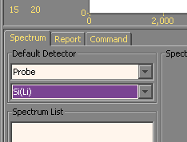
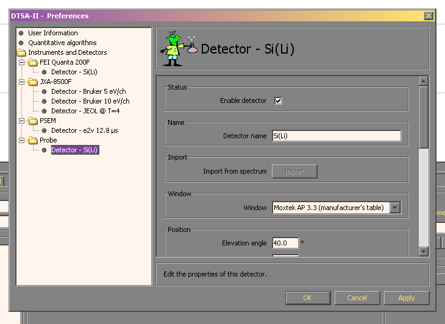
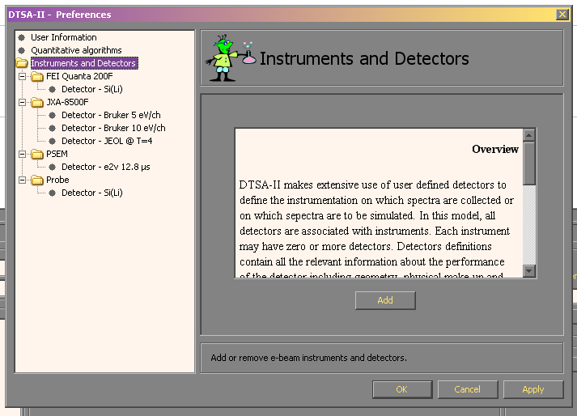
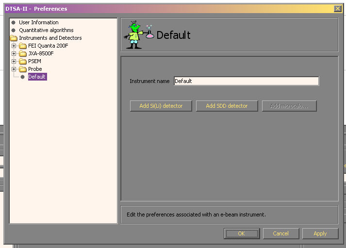
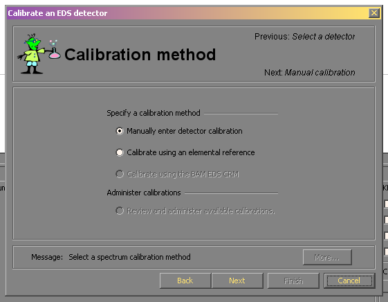

### Detectors

Detectors descriptions are a central component of DTSA-II. Many of the algorithms work poorly if the spectra are not associated with a suitable detector description. It is through the detector description that DTSA-II knows about detector calibration, detector performance and detector geometry.

Each time you load a spectrum from a disk file DTSA-II tries to associate a detector. On the main panel above the spectrum list are two drop-down list boxes. These contain a list of instruments and a list of detectors associated with the active detector. When you load a spectrum, DTSA-II will attempt to update the instrument and detector related parameters from the spectrum file with the parameters from the default detector. This may overwrite some parameters read from the file with those from the default detector. This is usually a good thing however you may disable this behavior by selecting the instrument and detector called "-- None --".

  
**Figure:** The default detector selection boxes located on the main application panel.

Before you sit down to perform work with DTSA-II you should create detectors for each detector configuration used in your lab. If you are fortunate enough to have multiple electron beam instruments then DTSA-II associates detectors with instruments. Each instrument may have multiple detectors. A single detector describes the nominal detector geometry, construction and a performance characteristics. A single physical detector might have multiple detector descriptions within DTSA-II if this detector is used with a range of different time constants or other performance determining characteristics.

  
**Figure:** The detector configuration pages within the Preferences dialog.

### Creating detectors

Detectors are created through the _File-Preferences_ menu item and the associated Preferences dialog. _Detectors_ are associated with _Instruments_. The first time DTSA-II starts a single instrument is created called "Probe" and associated with this is a single detector called "Si(Li)". This detector represents a good performance modern Si(Li) detector. You will probably want to create additional instruments and detectors that better reflect your labs capabilities.

First, you will probably want to create a new instrument. In the left-hand tree-view window select the "Instruments and Detectors" line. This panel will display.

  
**Figure:** The instruments and detectors panel within the preferences dialog.

Use the _Add_ button to create a new instrument. You will be brought to a new _instrument panel_ which looks like this.

  
**Figure:** The instrument panel within the preferences dialog.

You may specify a name for your instrument here. You may change the name later if you find you are dissatisfied with your initial choice.

Initially your new instrument will have no associated detectors. You may add one from the instrument panel using the _Add Si(Li)_ or _Add SDD_ buttons. The relationship between detectors and instruments is summarized in the tree view to the left of the dialog. Each instrument may have multiple detectors and each physical detector might have multiple detector descriptions.

You will be asked to specify some information about your detector. The more accurately this information reflects your detector the better DTSA-II will perform. Having said this, it can be hard to get firm answers for some of these parameters from your EDS vendor. Do your best.

#### Configuration Items

*   _Name_ - Your choice but it should be sufficiently descriptive to make it easily to pull out of a list.
*   _Window_ - Select the best match for the window on your detector. If you don't know your window but have a "light element detector" one of the Moxtek windows won't be too far wrong.
*   _Elevation angle_ - Imagine plane perpendicular to the electron beam. Measure the angle up from the plane to the detector. This is the elevation angle. (This is often called the _take-off angle_ although the true take-off angle can be different if the sample it tilted.)
*   _Azimuthal angle_ - Face the front of the instrument and imagine looking down the axis of the column. To your right is 0°, forward is 90°, left is 180° and towards you is 270°.
*   _Optimal working distance_ - The working distance at which the axis of the electron beam and the axis of the detector intersect.
*   _Sample-to-detector distance_ - The distance from the detector crystal to the intersection of the electron beam and detector axes.
*   _Detector area_ - The active area of the detector. This is normally 10 mm2 although 5 mm2, 30 mm2, 40 mm2 and 50 mm2 are not uncommon too.
*   _Gold layer_ - The thickness of a conductive gold coating on the front face of the detector. Not all detectors have a gold layer.
*   _Aluminum layer_ - The thickness of a conductive aluminum coating on the front face of the detector. Usually detectors either have a gold layer or an aluminum layer.
*   _Dead layer_ - The thickness of a semi-active layer of uncompensated Si on the front surface of the detector.
*   _Thickness_ - The thickness of the active portion of the detector.
*   _Number of channels_ - The number of channels in a recorded spectrum.
*   _Zero strobe discriminator_ All channels below this energy are set to zero before the spectrum is processed. This eliminates the zero strobe found on some detectors.
*   _Energy scale_ - The number of eV per channel.
*   _Zero offset_ - The number of eV the first data point in the spectrum is offset from zero. A negative offset indicates that the spectrum data starts before zero. This is common for detectors with a zero strobe.
_Resolution_ - An estimate of the detector resolution (FWHM at Mn Kα)

The _Import from spectrum_ button allows you to load nomimal values for many detector parameters from a spectrum file. Use this with care. Usually the energy scale, zero offset and number of channels are correct but often other information recorded in the spectrum file is just plain wrong. Items that were loaded from the spectrum file will be identified by a yellow background in the associated edit box.

The first time you create a detector you can edit the _number of channels_, the _energy scale_, the _zero offset_ and the _resolution_. Subsequent times these properties are disabled. You can update them but you must use the calibration tool which is accessed through the _Tools_ - _Calibration Alien_ menu item.

### Calibration

The properties of the detector are divided into two types - those which change with time and those that don't. The properties that change with time are called the _calibration_. The calibration includes such properties as zero offset, energy scale and resolution. DTSA-II provides special tools for measuring and setting these parameters. These tools are accessed through the _Tools_ - _Calibration Alien_ menu item. The calibration tool associates calbrations with points in time. Thus the calibration of a detector may evolve as the detector ages. When a spectrum is loaded, it is automatically associated with the most recent calibration before the spectrum was collected. (You may change this association using the _Tools_ - _Edit Spectrum Properties_ menu item.) When you first create a detector the calibration is associated with a date very far in the past. Subsequent calibrations can be associated with any date but default to the date on which the calibration spectrum was collected.

  
**Figure:** The calibration dialog. You may manually enter calibration values or you may calibrate using a measured spectrum (the preferred way.)
