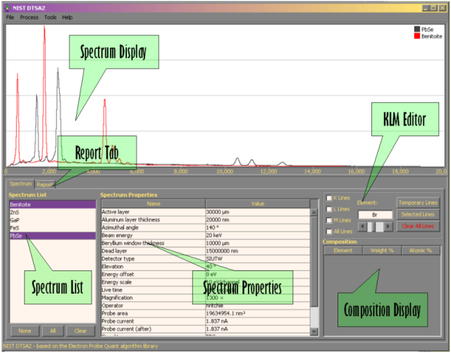
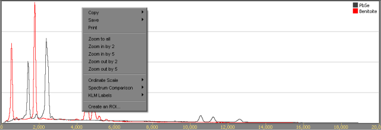
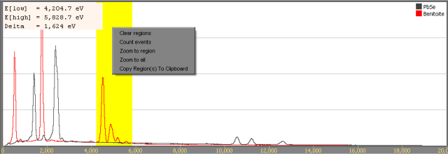
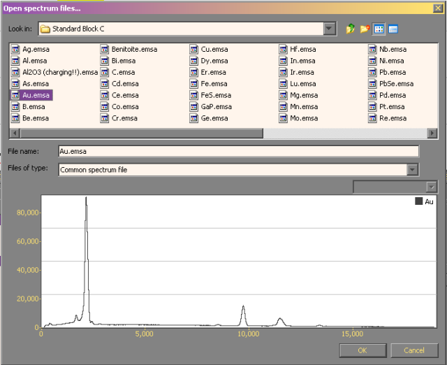
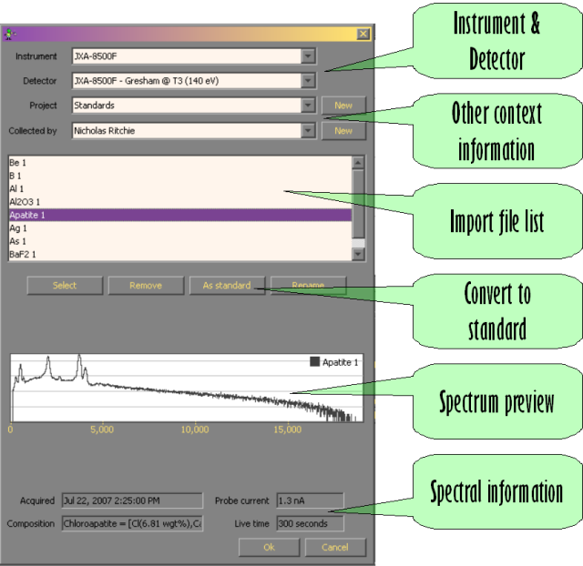

# Basic Navigation

The main screen on DTSA-II is split horizontally into **two resizable sections**. The top section contains a **spectrum display and manipulation** window. The bottom section contains tabbed panels displaying **spectrum information** and **report information**. An application menu is also associated with the main screen. This menu contains sub-menus for _file_ related tasks, spectrum _processing_ related tasks, advanced _tools_ and basic _help_ The menus are discussed [here](#MainMenu).

The **spectrum panel** is divided into three vertical panels - the **spectrum list**, the **spectrum properties**, and a panel containing the **KLM editor** and a **composition display**. The **spectrum list** is used to manage the available spectra. When a spectrum is read from disk or from the spectrum database, the display name of the spectrum will be shown here. To display a spectrum, select the name of the spectrum in this list. Multiple spectra may be displayed simultaneously by holding the _control_ or _shift_ keys while selecting the display names with the mouse.

The **spectrum properties** panel displays the properties of the spectra selected in the spectrum list. If only one spectrum is selected, the properties will be those of this spectrum. If more than one spectrum is selected, only those properties which share identical values in all displayed spectra are displayed. The spectrum properties are derived from the properties available in the file or database record from which the spectrum was read and any additional properties applied to the spectrum by the operator. For example, when you specify which instrument and x-ray detector was used to collect a spectrum, a large number of instrument and detector related parameters are defined. Alternatively, you may edit the spectrum properties using the _Edit spectrum properties_ menu item and dialog.

The **KLM editor** allows you to add characteristic x-ray energy lines to the spectrum display. You may select an element by typing the name or the common abbreviation into the _Element_ edit box or you may use the slider below the edit box to scroll through the elements. As an element is selected, a series of temporary KLM lines will display on the spectrum display. To make these lines permanent, check one of the _K lines_, _L lines_, _M lines_ or _All lines_ boxes. Multiple line families from multiple elements can be displayed simultaneously. You may remove individual line families by selecting an element and unchecking the associated box. You may clear all permanent lines by pressing the _Clear all lines_ button. It is possible to fine tune which lines are displayed using the menus displayed when the _Temporary lines_ or _Selected lines_ buttons are pressed.

The **composition display** displays the composition of the selected spectrum or spectra. There are multiple different types of compositional measures can be associated with a spectrum. The different types depend upon how the measure was derived and how reliable it is. The most reliable measure of composition is called the _standard composition_. The standard composition is usually determined by wet chemistry or some other non-microanalytical method. Another common measure of composition is called the _microanalytical composition_. This measure of composition is derived from a microanalytical measurement and is often associated with a spectrum when the spectrum is quantified using one of DTSA-II's quantification algorithms. The composition display shows the most reliable available composition metric. If more than one spectrum is selected in the spectrum list then a composition will not display unless both materials share a common composition.

### The Spectrum Display

The **spectrum display** is a very powerful tool in its own right.

*   **Spectrum scaling** - Spectra may be displayed on _linear_, _log_ or _square root_ scaled axes. The horizontal axis may be scaled to zoom in on particular features.

*   **Linear axes** are the most common display method and show the spectra in the most familiar format.
*   **Log axes** are useful for looking for small features on a large background.
*   **Square root** axes display the spectra in such a manner that the relative size of the count statistics is independent of peak height.

*   **Spectrum comparison** - Spectra may be compared with each other using a number of different methods to scale the spectra relative to each other.
    *   **Maximum peak** - Scales the spectra so that the maximum height peak in each is close to filling the vertical scale.
    *   **Constant flux 1 nA S** Scale the spectra to a constant incident beam flux of 1 nanoamp per second. This facilitates absolute comparison of spectra collected with different probe currents and for different acquisition times.
    *   **Equal integral** Scales the spectra by normalizing the height relative to the sum of the counts in the entire spectrum.
    *   **Region integral** Scales the spectra by normalizing the height relative to the sum of the counts in the current selected regions-of-interest.
*   **Spectrum output** - The spectrum display may be copied to the clipboard or printed.

*   **Copy** - The current spectrum display view can be copied as a bitmap to the clipboard.
*   **Print** - The current spectrum display view can be sent to a system available printer. The quality of the output may exceed the quality of the bitmap but will be limited by device capabilities.
*   **Save** - The current spectrum display view can be saved to disk as a portable network graphic file (PNG file.)
*   **Save as GNUPlot script** - The current spectrum display view can be saved to disk as a [GNUPlot](https://www.gnuplot.info/) script. The GNUPlot script is suitable for publication quality output using GNUPlot in combination with LaTex. This is an advanced and mostly undocumented option.
*   **Save elements** - Copy a list of the elements for which there are KLM lines currently displayed.

*   **KLM lines** - The spectrum display window works in consort with the KLM dialog to display characteristic lines and edge energies overlayed on the spectrum. The KLM labels can be controlled to display a brief label, a long label, or a large label. By default all labels are identified using UIPAC notation (ie. K-LIII is equivalent to Kα1) unless the Siegbahn notation is specially selected. DTSA-II favors the more modern and less ambiguous IUPAC notation.

*   **Region-of-Interest Manipulation** - Multiple regions-of-interests can be selected using the spectrum display. A region-of-interest may be marked by clicking-and-dragging on the spectrum display window. The region will display in blue during the click-and-drag operation and in yellow after the operation is complete. When the operation is complete the high, low and energy width of the region-of-interest is displayed for a few seconds in the upper left hand corner of the display window. You may right-click this information window to copy the information to the clipboard.

*   **Merging of ROIs** - Regions-of-interest that overlap are merged.
*   **Region-of-interest menu**  
    

*   **Clear regions** - Clear all defined region-of-interests.
*   **Integrate ROIs** - Integrate the counts in each spectrum in all the selected region of interests. A linear background is estimated for each ROI and each spectrum and this number is also reported. The integrated counts are reported in a window that displays for a few seconds in the upper left corner of the spectrum display window. The format of this data is as follows. There is a line per spectrum. Each line contains first the total number of counts in the all ROIs, second a linear estimate of the background, third an estimate of the error in the difference of the quantity the total-background counts from count statistic estimates and finally the name of the spectrum.
*   **Zoom to region** - Allows zooming to a sub-region on the energy axis.
*   **Copy regions to clipboard** - Copies a text version of the channel-by-channel data in the selected region to the clipboard. The first two columns represent the min and max energy for the channel, the remaining channels represent the data in each spectrum for this channel.

### Spectrum List

The spectrum list is used to select and manage spectra. When a file is read (using the _File - Open_ dialog), retrieved from the database or created within the program, it is added to the spectrum list. There is no fundamental limit to how many spectra may be loaded simultaneously.

*   **None** - Unselect all the spectra in the spectrum list. Following this operation the spectrum display, the spectrum properties and the composition display will be empty.
*   **All** - Select all spectrum in the spectrum list.
*   **Clear** - Purge the selected spectra from memory and remove them from the spectrum list.

### The Main Menu

*   **File** - The file menu provides functions for manipulating spectra on disk or in the database, to print spectra or reports, and to configure the program.

*   **Open** - Read a spectrum from a file on disk. Many different spectrum file formats are supported including EMSA 1.0 standard, SPC, ASPEX TIFF, and DTSA file. If the file type is supported it will display in the preview window when you select it. You may select multiple spectrum files simultaneously. Files containing multiple spectra will open all spectra within the file. 
*   **Save** - Write the files currently selected in the spectrum list to EMSA 1.0 files.
*   **Bulk rename** - Facilitates renaming multiple spectra in a directory based on the contents of the file.
*   **Import from CSV** - Facilitates importing spectra from comma-separated value files. The first two entries in the first column is used to determine the channel width. Subsequent columns are assumed to contain counts data.
*   **Batch export** - Converts multiple spectra files from one of the supported read formats into either comma-separated value file or EMSA 1.0 compatible files.
*   **Import into database** - Import spectra into the database. The database stores spectra in their full fidelity form plus it associates an instrument, a detector, a project and an analyst with each spectrum. It is also possible to specify that a spectrum is a standard in which case the composition of the standard is also recorded in the database. Spectra recorded as standards in the database are quick and easy to use for quantification. 
*   **Search database** - An assistant interface for searching and retrieving spectra from the database. There are a number of different search modes to facilitate finding spectra based on various different properties of or contextual information about the spectrum.
*   **Print** - Print either the current spectrum display or the current report in the report tab.
*   **User preferences** - Allows you to specify programmatic options or to define instrument and detector configurations.
*   **Exit** - Terminate the program. The report is automatically stored to disk but all other files such as open spectra are discarded. You will not be asked any idiot protection messages.

*   **Process** - This menu contains mostly atomic spectrum processing operations such as smoothing, peak search and background fitting. The process menu items all act on the spectra which are currently selected in the spectrum list.
    *   **Sub-sample spectrum** - Uses a statistically valid mechanism for sub-sampling a spectrum to simulate a spectrum that was collected for fewer seconds than the selected spectrum.
    *   **Duplicate** - Make a replica of the current spectrum
    *   **Absolute value** - Take the absolute value of each channel in the current spectrum
    *   **Sum**Sum all the selected spectra into a single sum spectrum.
    *   **Strip background** - Applies a crude background stripping algorithm to remove the background component of the selected spectra.
    *   **Fit background** - Fits a quadratic background model to the selected spectra. If the composition of the current spectrum is not available, you will be asked to specify a composition. If the spectrum display has region-of-interests defined, these will be used to fit the background. Otherwise region-of-interests are automatically selected based on the composition of the material and the properties of the detector on which the spectrum was collected.
    *   **Linearize energy axis** - Rescale the energy axis based on the specified non-linear function.
    *   **Smooth** - Applies a 5th-order Savitsky-Golay smoothing function to the spectrum.
    *   **Trim** - Eliminates an peaks within the selected regions-of-interest by fitting a linear background and extending the background through the peak.
    *   **Peak search** Identifies all ranges of channels in which the channel contents are at least 3σ above the surrounding background
*   **Tools** - More advanced functions for spectrum processing and creation.
    *   **Edit spectrum properties** - Brings up a dialog which allows the user to change the properties associated with the spectrum.
    *   **Simulation alien** - Brings up an assistant dialog which walks the user through the process of simulating an EDS spectrum.
    *   **Quantification alien** - Brings up an assistant dialog which walks the user through the process of performing a standards-based quantification of a spectrum.
*   **Help** - Items for assisting the user.
    *   **About** Displays information about the DTSA-II application.
