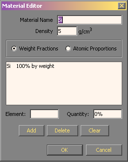
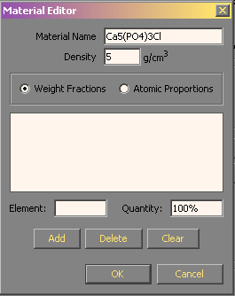
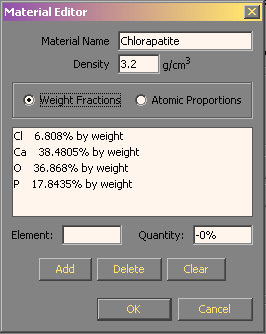
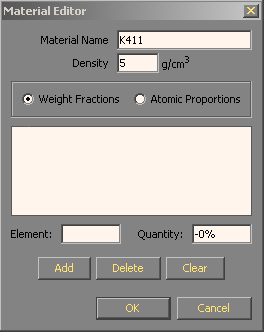
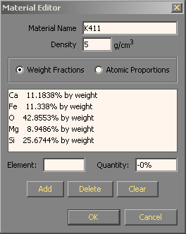

# The Material editor

The material editor is used to define the composition and density of bulk materials. The editor is simple but provides a number of powerful features.

*   Converts chemical formulas into compositions
*   Remembers previously entered materials by name in the database
*   Converts between weight fractions and atomic proportions while retaining the original format
*   Provides a clue as to how much unaccounted for mass remains

### Basic weight percent entry

In the most basic mode of operation, you can specify a human friendly name for the material in the **Material name** edit box and a nominal density in g/cm3 in the **Density** edit box. You can enter the composition element-by-element using the **Element** and **Quantity** edit boxes. Assuming that the **Weight fractions** radio button is highlighted, type in either the common one or two letter element abbreviation, the atomic number or the full element name in the Element edit box and enter the weight fraction in percent in the Quantity edit box. Press the **Add** button or **Alt-A** keystroke to add the element and quantity to the element list. Each time you enter a new element, the quantity edit box will update to show the remaining difference from 100%. If you enter an element in error, you may remove that element by selecting it in the element list and pressing the **Delete** button or **Alt-D** keystroke. To remove all elements from the current material use the **Clear** button or **Alt-C** keystroke.

### By chemical formula

Alternatively, if the material is readily described using a chemical formula, you may easily define the material by entering the chemical formula into the **Material name** edit box. First make certain that the element list is empty by pressing the **Clear** button. Enter the formula in the material name edit box and when the cursor leaves material name edit box, the formula will be parsed and the correct proportion of each atom type will be entered into the element list. This method will work for simple formulae like "SiO2" for SiO2 or more complex formulae like "Ca5(PO4)3Cl" for chlorapatite (Ca5(PO4)3Cl). Once the list of elements has been defined, you can go back and change the name to a more human friendly one.

|     |     |
| --- | --- |
|  |  |

### Recalled from the database

Finally, you can search the database by material name. Once you have defined the material K411 once, the composition is recorded in the database by name. If the element list is empty (the clear button), when you enter the name into the material name edit box and then press the tab key or otherwise exit this edit box, the program will search the database. If a material with the specified name is found, it will be loaded into the editor.

|     |     |
| --- | --- |
|  |  |
