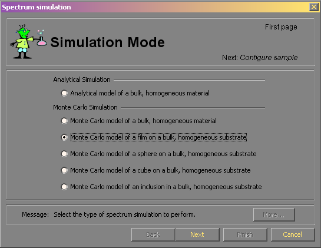
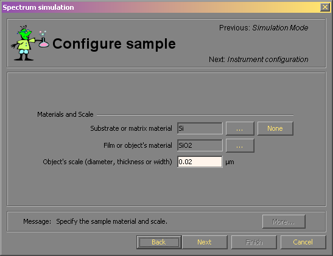
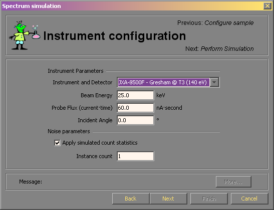
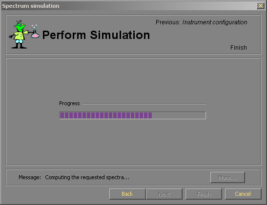
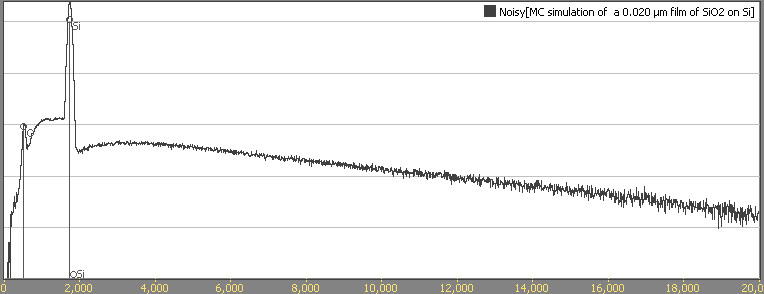

# Simulating Spectra

Simulating spectra is very easy with DTSA-II. For spectra of bulk materials, there are two different ways to simulate a spectrum - the Monte Carlo simulation and the analytical simulation. A Monte Carlo simulation takes more time but is capable of handling more sophisticated geometries. Monte Carlos simulation is the only option for films, spheres, cubes or inclusions.

### Monte Carlo simulation

Monte Carlo simulations follow the randomized trajectories of energetic electrons as they interact with the sample material. The electron can interact with the material through energy loss (inelastic) or non-energy loss (elastic) scattering events. The energy loss events typically involve small amounts of energy lost to the valence electrons of the sample material. These events happen thousands or times per trajectory. The non-energy loss events involve scattering the electron off of the nucleus of the atom. These events happen many hundreds of times per electron trajectory. Finally, every hundreds or so electrons, the incident electron will knock out a core electron from an atom in the sample material. The atom will temporarily be placed in an unstable excited state. The excited state may relax via either ejection of a energetic electron (an Auger electron) or via ejection of an energetic photon (an x-ray.) When an x-ray is ejected, the x-ray is tracked to the detector and recorded by a simulated detector via a model of the detector performance.

Because Monte Carlo simulations must follow the trajectory of hundreds or thousands of electrons as they interact with the sample and each trajectory involves hundreds of scattering events, Monte Carlo simulations take more computer processor time. On a modern CPU, with a software optimized for x-ray simulation, it is possible to simulate a single spectrum in about a minute.

### Analytical Simulation

Rather than tracking the electrons individually, it is more computationally efficient if albeit less flexible to model the atomic excitation process using a mechanism called a φ(ρz) curve. A φ(ρz) curve represents the efficiency of generation of atomic excitation as a function of the depth of penetration into the material. Near the surface, the electron is energetic and is more likely to ionize an atom. However typically, the peak of the φ(ρz) curve is actually slightly inside the material because of two effects. First, the path length of the electron per slice of material increases as the electron is deflected from normal incidence. Second, the ionization cross section tends to increase as the electron slows down to about 2 times the ionization energy. Similar to the Monte Carlo method, generated x-rays are tracked back to a simulated detector. The intervening material can absorb x-rays and emit secondary fluorescence. The detector then measures the x-ray with a certain detector response function. The Monte Carlo and analytical models share the same detectors to facilitate intercomparison.

### Characteristic and Bremsstrahlung

Both the Monte Carlo and the analytical simulations provide a mechanism to simulate both the characteristic and Bremsstrahlung x-rays. Characteristic x-rays are the x-rays of specific energies emitted when an atom is ionized and relaxes via an x-ray emission. Bremsstrahlung x-rays are emitted when an electron is accelerated or decelerated by an electro-magnetic field. These can happen at any energy between the incident energy of the electron and zero energy. The shape of the Bremsstrahlung emission profile as measured is determined by the cross section for Bremsstrahlung emission, the energy distribution of the slowing electrons and the detector response function.

The Monte Carlo simulation uses a Bremsstrahlung model involving emission cross sections which is evaluated as the electron slows down. The analytical model uses the analytical expression of _Small et al_.

### Performing a simulation

Regardless of whether you wish to perform a Monte Carlo or analytical simulation, you start by selecting the **Tools - Simulation alien** menu item. You will be lead through the simulation configuration using DTSA-II's alien assistant interface.

The first page prompts you to select a simulation model. You may either select an Analytical simulation of a bulk material or a Monte Carlo simulation of a bulk, a film, a sphere, a cube or an inclusion. Select a simulation and proceed by pushing the _next_ button.

Next you will be asked to configure the sample. For a simulation of a bulk substrate, you will only be able to specify a single material. For a film, a sphere, a cube or an inclusion you will be able to specify two materials - one for the substrate (which may be None to represent film, sphere, cube or inclusion in vacuum) and one for the object. Pressing the button with "..." will bring up the [Material Editor](materialEditor.md). In addition, if you are simulating a film, sphere, cube or inclusion you will be asked to specify a scale for the object in µm.

The next page asks you to specify information about the instrument and detector you wish to simulate. This step specifies the detector geometry, the sample positioning, the detector resolution, the detector window and other important parameters in a single efficient step. If you need a new detector, please configure it using the **File - User preferences** menu item before initiating the simulation alien. You will also be asked to provide instrument configuration information like the beam energy, the simulated probe flux and the incident angle at which the beam strikes the sample. The **beam energy** is typically in the 5 to 35 keV range. The **probe flux** represents the probe current times the acquisition time. Common probe currents are in the 0.1 to 1 nA range and acquisition times may range from seconds to minutes. The **incident angle** represents the angle which the sample is rotated away from normal to the incident beam and towards the direction of the x-ray detector. It may be between -90°and 90°.

Finally, you may select to add simulated Poisson count statistics to the resulting spectrum. The probe flux will determine the magnitude of the spectrum and by selecting this check box you can specify whether the resulting spectrum will be free of count statistic noise or not. In addition, you may specify to generate multiple spectra simultaneously which differ only in the count statistics applied to the noise free spectrum.

When you press next this time, you will initiate the calculation. For the analytical model, the calculation will be done almost instantaneously. The Monte Carlo simulation may take a minute or two. When the computation is complete the **Finish** button will be enabled. Pressing the finish button will copy the resulting spectra to the Spectrum List. You will be able to manipulate the spectrum just as you would a real measured spectrum.

The simulation resulting from the above steps on a log-scale. You can see the result of the 20 nm SiO2 film as a small O peak.
